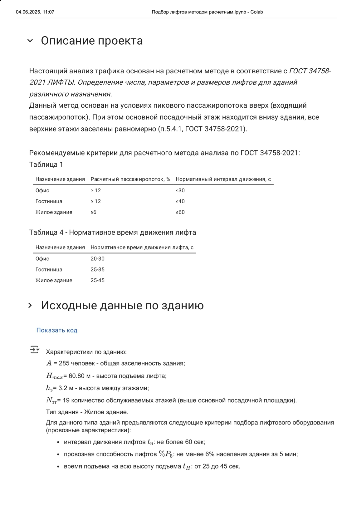

Расчетный метод анализа трафика для определения числа, параметров и размеров лифтов для зданий различного назначения на основе ГОСТ 34758-2021 (ISO 8100-32-2020) с применением python, numpy, pandas, matplotlib, math.
Отчёт включает подробное описание расчета с формулами и подстановкой значений переменных для возможности подачи в экспертизу.  

